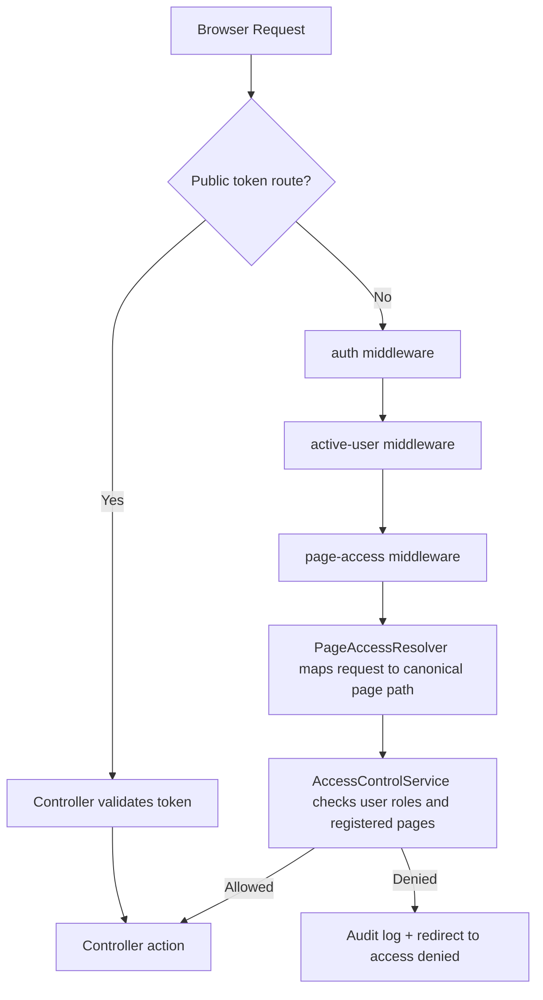
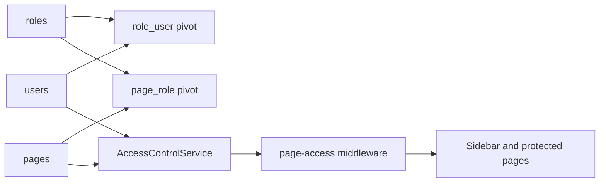
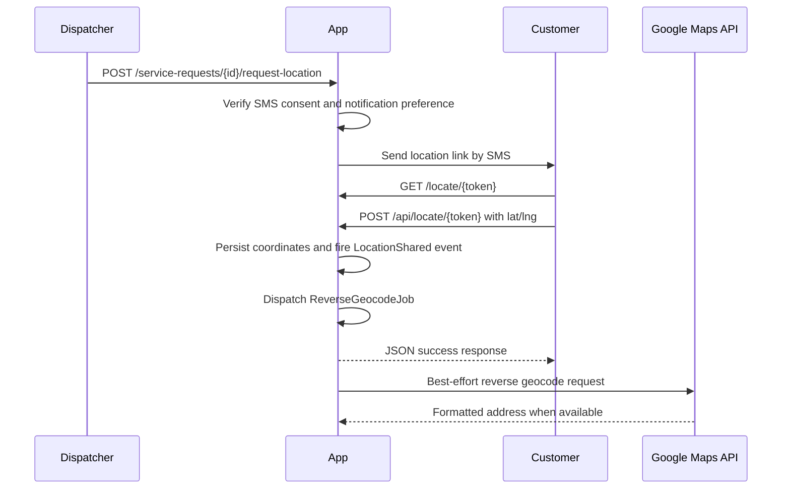

# Architecture Reference

Last audited: 2026-03-08

## Overview

The application is a Laravel monolith with a shared-hosting-compatible deployment option. Most operational workflows run inside the main app, while the lite webhook proxy exists for environments where deploying the full framework publicly is impractical.

## Top-Level Modules

| Module | Primary responsibility | Key code anchors |
|---|---|---|
| Access control | Authentication, active-user enforcement, page registry, role-to-page assignment, audit logging | `routes/auth.php`, `app/Services/Access/*`, `app/Http/Controllers/Admin/*` |
| Dispatch | Service request intake, rapid dispatch, status transitions, evidence, warranties, signatures, photos | `app/Http/Controllers/ServiceRequestController.php`, `RapidDispatchController.php`, related models/tests |
| Messaging | Telnyx SMS delivery, inbound webhook handling, templates, correspondence history | `app/Services/SmsService.php`, `app/Http/Controllers/Webhooks/TelnyxWebhookController.php` |
| Customer-facing approvals | Tokenized location, estimate approval, change-order approval, and signatures | `LocationShareController.php`, `EstimateApprovalController.php`, `ChangeOrderController.php`, `SignatureController.php` |
| Commercial workflow | Estimates, work orders, invoices, receipts, payments | `EstimateController.php`, `WorkOrderController.php`, `InvoiceController.php`, `ReceiptController.php` |
| Finance and vendor ops | Accounts, journals, expenses, financial reports, vendors, vendor documents | `AccountingController.php`, `ExpenseController.php`, `VendorController.php`, `VendorDocumentController.php` |
| Documents and AI | Document inbox, AI categorization, transaction imports | `DocumentInboxController.php`, `DocumentController.php`, `ProcessDocumentIntelligenceJob.php`, `ImportDocumentTransactionsJob.php` |
| Configuration and monitoring | Settings UI, API monitor endpoints, security headers | `SettingsController.php`, `ApiMonitorController.php`, `SecurityHeaders.php` |

## Request and Authorization Flow

## RBAC Data Flow

## Customer Location Flow

## Deployment Shape

### Main Laravel application

- Hosts authenticated back-office routes and the built-in public token routes.
- Uses database-backed sessions and queue by default.
- Can run locally with `composer dev` or on a fuller host with standard Laravel deployment patterns.

### Lite webhook proxy

- Lives under `deploy/lite-webhook-proxy/`.
- Intended for cPanel/shared-hosting environments that cannot expose the full Laravel app cleanly.
- Handles Telnyx webhook verification and customer GPS capture without depending on Composer or the framework runtime.

## Security Controls

- Authenticated routes are grouped under `auth`, `active-user`, and `page-access`.
- Public endpoints rely on signed or opaque tokens plus expiry checks.
- Webhooks are signature-verified before payload processing.
- `SecurityHeaders` adds header-level browser hardening, including geolocation scoping to same origin.
- User state changes, page access denials, role updates, and page sync actions are written to `audit_logs`.

## Operational Notes

- Reverse geocoding is enrichment, not the primary success path.
- Public APIs are intentionally narrow: location capture and Telnyx webhooks are the main unauthenticated endpoints.
- Internal AJAX routes live in `routes/web.php` under session auth so they inherit the same RBAC model as full-page requests.