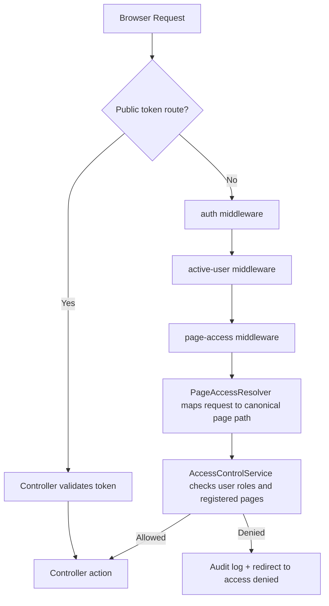
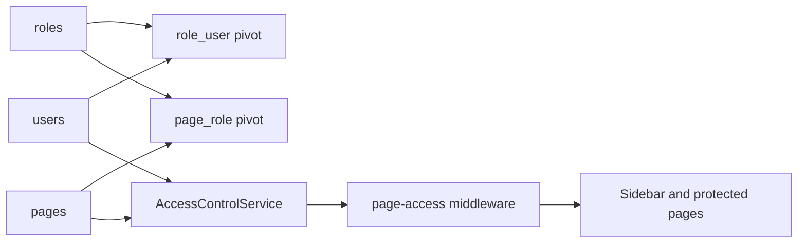
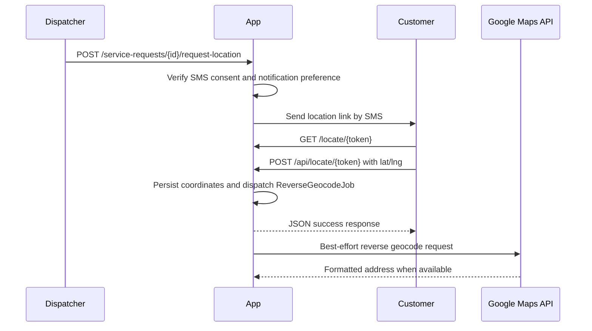
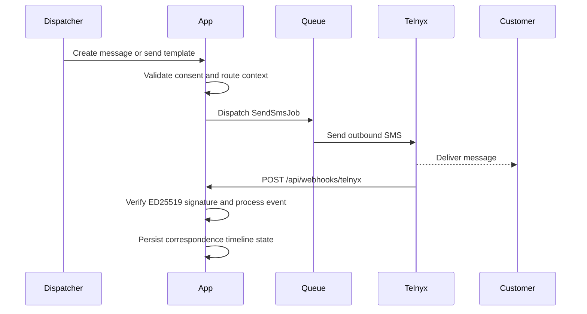
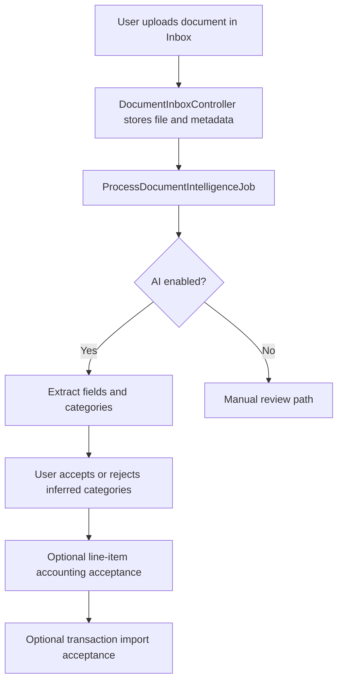

# Design and Architecture Reference

Last audited: 2026-04-07

## 1. Executive Summary

This application is an internal roadside-assistance operations platform built as a Laravel monolith. It manages intake, dispatch, customer messaging, approvals, estimates, work execution, invoicing, receipts, accounting, vendor operations, document intelligence, and RBAC-controlled administration.

The primary deployment shape is the main Laravel app. A lite webhook proxy exists for shared-hosting environments where exposing a full Laravel runtime is impractical.

## 2. System Shape and Constraints

### Runtime model

- Backend: Laravel 12, PHP 8.2+
- Database: MySQL
- Session and queue defaults: database-backed
- Frontend: Blade views with Vite-built assets

### Architectural constraints

- Shared-hosting compatibility is a first-class requirement.
- Public routes are intentionally narrow and tokenized where applicable.
- Authenticated application pages are RBAC-gated through page-level access control.
- Sensitive workflow changes must pass the actor-channel-stage-permission-owner gate documented in [workflow-context.md](workflow-context.md).

## 3. Feature Inventory and Code Anchors

### 3.1 Major modules

| Module | Responsibility | Key route and code anchors | Status |
|---|---|---|---|
| Access control | Authentication, user lifecycle, role/page assignment, audit logging | `routes/auth.php`, `routes/web.php` (`/admin/*`), `app/Http/Controllers/Admin/*`, `app/Services/Access/*` | Stable |
| Dispatch | Service request intake, rapid dispatch, lifecycle updates, technician assignment | `routes/web.php` (`/service-requests*`, `/rapid-dispatch*`), `ServiceRequestController`, `RapidDispatchController` | Stable |
| Customer and lead management | Leads, customer profiles, contact and vehicle context | `routes/web.php` (`/leads*`, `/customers*`), `LeadController`, `CustomerController` | Stable |
| Messaging and correspondence | Outbound SMS, inbound webhook handling, templates, timeline notes | `MessageController`, `CorrespondenceController`, `MessageTemplateController`, `app/Services/SmsService.php`, `Webhooks/TelnyxWebhookController` | Stable |
| Public approval workflows | Customer location capture, signatures, estimate approvals, change-order approvals | `routes/web.php` (`/locate/{token}`, `/sign/{token}`, `/estimates/approve/{token}`, `/change-orders/{token}`), `LocationShareController`, `SignatureController`, `EstimateApprovalController`, `ChangeOrderController` | Stable |
| Commercial lifecycle | Estimates, work orders, invoices, receipts, payment records | `EstimateController`, `WorkOrderController`, `InvoiceController`, `ReceiptController`, `PaymentRecordController` | Stable |
| Evidence and warranty | Photos, service logs, evidence package, warranty records | `PhotoController`, `ServiceLogController`, `WarrantyController`, `ServiceRequestController::evidence` | Stable |
| Document and AI processing | Inbox upload, matching, categorization, line-item acceptance, transaction imports | `DocumentInboxController`, `DocumentController`, `DocumentLineItemController`, `TransactionImportController`, `app/Jobs/ProcessDocumentIntelligenceJob.php`, `app/Jobs/ImportDocumentTransactionsJob.php` | Evolving |
| Finance and reporting | Chart of accounts, journals, ledgers, trial balance, P/L, balance sheet, financial dashboards | `AccountingController`, `ReportsController` | Stable |
| Expenses and vendors | Expense CRUD, vendor directory, vendor document posting and payment events | `ExpenseController`, `VendorController`, `VendorDocumentController` | Stable |
| Catalog and pricing | Service catalog and default pricing | `CatalogController`, catalog routes in `routes/web.php` | Stable |
| Settings, branding, monitoring | Global settings, tax rates, approval mode, API endpoint monitoring, logo serving | `SettingsController`, `StateTaxRateController`, `ApiMonitorController`, `BrandingController`, `app/Http/Middleware/SecurityHeaders.php` | Stable |
| Technician compliance | Optional technician profile compliance tracking and expirations | `TechnicianProfileController` | Optional |

### 3.2 Public and authenticated boundary

- Public, unauthenticated surfaces:
    - Tokenized customer pages under `routes/web.php`
    - GPS ingest and Telnyx webhooks under `routes/api.php`
- Authenticated surfaces:
    - All internal operations pages under `routes/web.php` within `auth`, `active-user`, `page-access`

## 4. Core Workflow Flows

### 4.1 Request and authorization flow

### 4.2 RBAC data flow

### 4.3 Customer location flow

### 4.4 SMS lifecycle flow

### 4.5 Document intelligence and import flow

### 4.6 Commercial lifecycle flow

- Intake and dispatch create and progress a service request.
- Estimate is drafted and optionally revised, then approval is requested via tokenized customer workflow.
- Approved estimate can produce work orders.
- Completed work orders can produce invoices.
- Invoices can produce receipts and associated payment records.
- Change orders can be created during work-order execution and approved through tokenized routes.

Primary anchors:

- `EstimateController`, `EstimateApprovalController`
- `WorkOrderController`, `ChangeOrderController`
- `InvoiceController`, `ReceiptController`, `PaymentRecordController`

## 5. Data Domains and Persistence

The schema is grouped by operational domain. Use [schema-reference.md](schema-reference.md) for table-level details.

Domain groups:

- Access and identity: users, roles, pages, role/page assignments, audit logs
- Core operations: service requests, status logs, customers, leads, vehicles, photos, signatures, warranties
- Commercial: estimates, work orders, change orders, invoices, receipts, payment records
- Messaging and consent: message templates, correspondence records, consent-related fields
- Finance: chart of accounts, journal entries, expenses, report-supporting aggregates
- Vendor operations: vendors, vendor documents, vendor document attachments and postings
- Document intelligence: document inbox artifacts, parsed document records, line items, transaction import rows
- Configuration and monitoring: settings, tax rates, API monitor endpoints

## 6. Security and Workflow Integrity

### 6.1 Authentication and authorization

- Authenticated routes are protected by `auth` and `active-user` middleware.
- Page-level authorization is enforced by `page-access` middleware plus access services.
- Admin access operations are auditable through `audit_logs`.

### 6.2 Public endpoint protections

- Public customer actions use opaque token routes with validation and expiry semantics.
- API endpoints for GPS ingest and webhooks are throttled in `routes/api.php`.
- Telnyx webhook requests are signature-verified with ED25519 using configured public key and timestamp tolerance.

### 6.3 HTTP and session hardening

- Security headers are set by `app/Http/Middleware/SecurityHeaders.php`.
- Session defaults are database-backed with `http_only` and `same_site=lax` controls.
- Web routes use CSRF protection by default.

### 6.4 Workflow context gate

For workflow-sensitive areas (consent, messaging, approvals, onboarding, payments, evidence, compliance), design and implementation must identify:

1. Actor
2. Channel
3. Stage
4. Permission owner
5. Recording mechanism

Reference policy and examples: [workflow-context.md](workflow-context.md).

## 7. Integrations and Async Processing

### 7.1 Integration boundaries

- Telnyx:
    - Outbound SMS dispatch via service layer and queue jobs
    - Inbound webhooks at `/api/webhooks/telnyx` and backwards-compatible `/api/webhook.php`
- Google Maps:
    - Reverse geocoding enrichment in background processing after location submission
- OpenAI-backed document intelligence (optional):
    - Controlled by `DOCUMENT_AI_ENABLED` and related configuration

Configuration details: [configuration.md](configuration.md).

### 7.2 Queue and jobs

Current first-party jobs in `app/Jobs/`:

- `SendSmsJob`
- `ReverseGeocodeJob`
- `ProcessDocumentIntelligenceJob`
- `ImportDocumentTransactionsJob`

Operational expectations:

- Queue connection defaults to `database`.
- Reverse geocoding and document AI are enrichment flows and should not invalidate already successful user actions.
- Shared-hosting deployments should rely on scheduler-safe execution patterns rather than assuming permanent workers.

## 8. Deployment Model

### 8.1 Main Laravel application

- Hosts the authenticated operations app and public tokenized pages.
- Recommended deployment keeps private code and storage outside the public web root.
- Requires writable `storage/` and `bootstrap/cache/`.

### 8.2 Lite webhook proxy

- Located at `deploy/lite-webhook-proxy/`.
- Intended for shared-hosting constraints where uploading full Laravel runtime or exposing it publicly is difficult.
- Supports webhook verification and location capture without full framework bootstrap.
- Must be kept behaviorally aligned with main-app webhook and location expectations.

Deployment and packaging details: [../README.md](../README.md).

## 9. Testing and Validation Expectations

- Use `php artisan test` (or `composer test`) for feature and unit validation.
- Feature tests should fake external integrations unless a test explicitly targets the integration boundary.
- Validate public token workflows and webhook verification behavior with representative happy-path and rejected-signature cases.
- Treat reverse geocoding and document AI failures as recoverable and observable, not as request-fatal behavior.

## 10. Known Design Risks and Guardrails

- Shared-hosting environments can drift in scheduler/queue reliability if not actively monitored.
- Lite webhook proxy can drift from main app behavior unless deployment updates are disciplined.
- Workflow-sensitive changes can become non-compliant if actor/channel/stage assumptions are implicit.
- As document intelligence evolves, acceptance/rejection and accounting-import traces should remain auditable.

## 11. Related References

- [development.md](development.md)
- [access-control.md](access-control.md)
- [admin-guide.md](admin-guide.md)
- [user-guide.md](user-guide.md)
- [api-reference.md](api-reference.md)
- [schema-reference.md](schema-reference.md)
- [configuration.md](configuration.md)
- [workflow-context.md](workflow-context.md)
- [documentation-audit-report.md](documentation-audit-report.md)